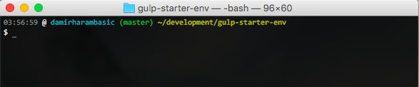

# bash_profile

TO USE: 
1. Download git-completion to your home(~) folder `curl -O https://raw.githubusercontent.com/git/git/master/contrib/completion/git-completion.bash`
2. Clone this repo into your root(~) directory. 
3. In your .profile add the line "source ~/bash_profile/profile.sh" 
4. In your Terminal do "refrash" and watch the magic happen. 

PREVIEW: 

